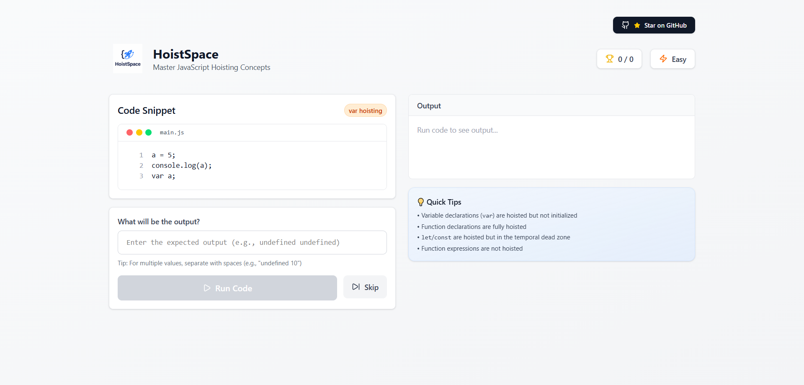
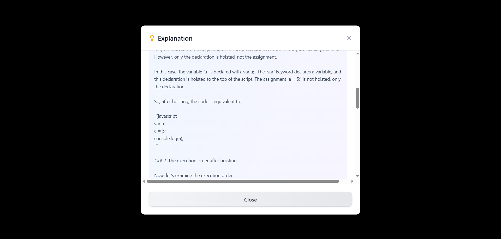

# HoistSpace

**Master JavaScript Hoisting Concepts** - An interactive learning platform to understand JavaScript hoisting through hands-on practice.


## ✨ Features

- 🎯 **150+ Curated Questions** - Comprehensive coverage of all hoisting scenarios
- 🏷️ **Question Categories** - Each question tagged by type (var-hoisting, function-declaration, let-const, etc.)
- 🤖 **AI-Powered Explanations** - Get detailed, context-aware explanations for every answer
- ⏭️ **Skip to Next** - Stuck on a question? Skip ahead and come back later
- 📊 **Progress Tracking** - Monitor your score and improvement over time
- 🎨 **Beautiful UI** - Clean, modern interface built with React and Tailwind CSS
- 🔄 **Random Questions** - Keep learning fresh with randomized question delivery
- 📱 **Fully Responsive** - Practice on any device - desktop, tablet, or mobile
- ⚡ **Real-time Feedback** - Instant validation of your answers
- 💡 **Quick Tips** - Helpful hoisting tips displayed alongside each question

## 🎮 Live Demo

[**Try HoistSpace Now**](https://hoistspace.shivamte.me)

## 📸 Screenshots

### Main Interface



### AI Explanation



## 🛠️ Tech Stack

- **Frontend**: React + TypeScript
- **Styling**: Tailwind CSS
- **Database**: Supabase (PostgreSQL)
- **AI Integration**: OpenAI GPT-4 / Groq
- **Icons**: Lucide React
- **Build Tool**: Vite
- **Deployment**: Vercel

## 🚀 Getting Started

### Prerequisites

- Node.js 18+ and npm/yarn
- Supabase account
- OpenAI API key or Groq API key (for AI explanations)

### Installation

1. **Clone the repository**

   ```bash
   git clone https://github.com/yourusername/hoistspace.git
   cd hoistspace
   ```

2. **Install dependencies**

   ```bash
   npm install
   # or
   yarn install
   ```

3. **Set up environment variables**

   Create a `.env` file in the root directory:

   ```env
   VITE_SUPABASE_URL=your_supabase_url
   VITE_SUPABASE_ANON_KEY=your_supabase_anon_key
   ```

4. **Set up Supabase**

   Run the SQL migrations in the `supabase/migrations` folder in your Supabase SQL editor:

   - `001_initial_schema.sql` - Creates tables and schema
   - `002_insert_questions.sql` - Inserts all questions

5. **Deploy Supabase Edge Function**

   ```bash
   # Install Supabase CLI
   npm install -g supabase

   # Login to Supabase
   supabase login

   # Link your project
   supabase link --project-ref your-project-ref

   # Deploy the edge function
   supabase functions deploy explain-hoisting

   # Set the API key secret
   supabase secrets set OPENAI_API_KEY=your_openai_api_key
   # OR for Groq
   supabase secrets set GROQ_API_KEY=your_groq_api_key
   ```

6. **Run the development server**

   ```bash
   npm run dev
   # or
   yarn dev
   ```

7. **Open your browser**

   Navigate to `http://localhost:5173`

## 🎯 How It Works

1. **Question Loading**: Questions are randomly fetched from Supabase
2. **User Input**: Type your expected output for the code snippet
3. **Validation**: Answer is normalized and compared with the correct output
4. **AI Explanation**: Click "Why is this the output?" to get detailed explanations
5. **Progress Tracking**: Your score and attempts are saved to the database

## 🤝 Contributing

Contributions are welcome! Here's how you can help:

1. Fork the repository
2. Create a feature branch (`git checkout -b feature/AmazingFeature`)
3. Commit your changes (`git commit -m 'Add some AmazingFeature'`)
4. Push to the branch (`git push origin feature/AmazingFeature`)
5. Open a Pull Request

### Adding New Questions

To add new hoisting questions, run this SQL in your Supabase SQL editor:

```sql
INSERT INTO hoisting_questions (code, correct_output, explanation, difficulty, category)
VALUES (
  'your_code_here',
  'expected_output',
  'detailed_explanation',
  'easy', -- or 'medium', 'hard'
  'var-hoisting' -- category name
);
```

## 📝 Question Categories

- `var-hoisting` - Variable hoisting with var
- `function-declaration` - Function declaration hoisting
- `function-expression` - Function expression behavior
- `let-const` - let/const temporal dead zone
- `scope-hoisting` - Scope-related hoisting
- `nested-scope` - Nested function scopes
- `declaration-precedence` - Declaration vs expression
- `block-scope` - Block scoping behavior
- And more...

## 🙏 Acknowledgments

- Inspired by the need to understand JavaScript hoisting better
- Built with modern web technologies
- AI explanations powered by OpenAI/Groq

## 📞 Contact

**Your Name** - [@shivamrtwt](https://x.com/shivamrtwt)

Project Link: [https://github.com/Shivgit42/hoistspace](https://github.com/Shivgit42/hoistspace)

---

⭐ **If you find this project helpful, please give it a star!** ⭐

Made with ❤️ by [Shivam](https://shivamte.me/)
